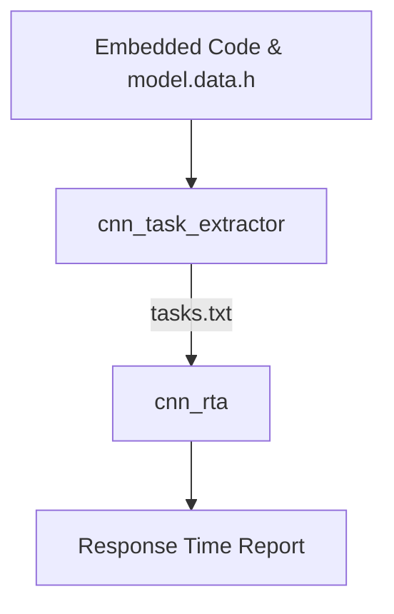

# NPUTaskAnalyzer

**NPUTaskAnalyzer** is a modular toolchain for analyzing the timing behavior of Convolutional Neural Networks (CNNs) deployed on heterogeneous embedded platforms with CPU and NPU co-execution.

It consists of two integrated subprojects:

---

## 📦 Subprojects

### 1. `cnn_task_extractor/` — Task Model Generator

This module extracts a task-level model of CNN inference from embedded C code and TFLite-generated files (`model.data.h`), producing a `tasks.txt` file for further analysis.

**Main features:**
- Parses CNN layer definitions and topology
- Identifies CPU vs. NPU execution
- Estimates layer size and execution time (WCET)
- Outputs task set with dependencies and deadlines

📄 Output: `tasks.txt`

📁 See [`cnn_task_extractor/README.md`](cnn_task_extractor/README.md)

---

### 2. `cnn_rta/` — Response Time Analysis Engine

This module computes the **Worst-Case Response Time (WCRT)** of each CNN layer task based on:
- Precedence constraints
- Resource contention (CPU/NPU)
- Non-preemptive blocking
- Interference from concurrent CNNs

**Main features:**
- Supports multiple CNNs with shared resources
- Blocking and interference model considers node capacities
- Detailed breakdown: \( R_i = C_i + B_i + I_i \)
- Schedulability test against per-layer deadlines

📄 Input: `tasks.txt`  
📄 Output: console summary or CSV (planned)

📁 See [`cnn_rta/README.md`](cnn_rta/README.md)

---

## 🧠 Workflow



---

## 🚀 Getting Started

### 1. Build both modules
```bash
cd cnn_task_extractor && make
cd ../cnn_rta && make
```

### 2. Extract task model
```bash
./cnn_task_extractor model.data.h main.c
```

### 3. Run response time analysis
```bash
cd ../cnn_rta
./cnn_rta
```

---

## 🔍 Future Improvements

- Automatic parsing of MAC counts
- Integration with YAML-based models
- WCET calibration with profiling
- Visualization of task graphs and scheduling timelines

---

## 📄 License

MIT License — for academic and research use.

---

## 👤 Author

Developed by [Votre Nom] as part of a research effort on timing analysis and scheduling of DNNs on embedded NPUs.
